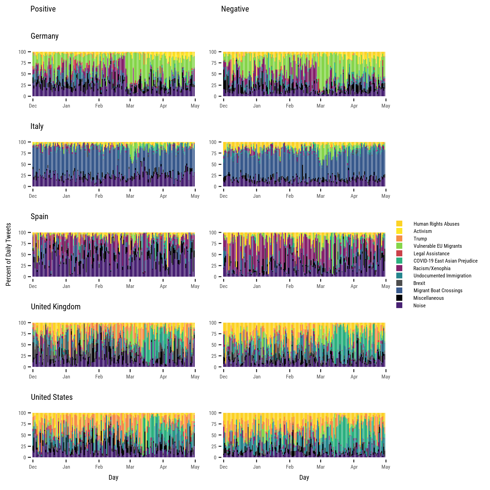

# Using Twitter to Track Immigration Sentiment During Early Stages of the COVID-19 Pandemic

[Francisco Rowe](http://www.franciscorowe.com) [[`@fcorowe`](http://twitter.com/fcorowe)]<sup>1</sup>, Michael Mahony<sup>1</sup>, [Eduardo Graells-Garrido](http://datagramas.cl) [[`@carnby`](https://twitter.com/carnby)]<sup>2</sup>, [Marzia Rango](https://migrationdataportal.org/de/node/2945) [[`@MarziaRango`](https://twitter.com/MarziaRango)]<sup>3</sup>, [Niklas Sievers](https://migrationdataportal.org/author/niklas-sievers) [[`@niklas_sievers
`](https://twitter.com/niklas_sievers)]<sup>3</sup>

<sup>1</sup> *Geographic Data Science Lab, University of Liverpool, Liverpool, United Kingdom*

<sup>2</sup> *Data Science Institute, Universidad del Desarrollo, Santiago, Chile*

<sup>3</sup> *Global Migration Data Analysis Centre (GMDAC), International Organization for Migration, Berlin, Germany*

## Description

This repository contains the relevant data and code to replicate the analysis and results reported in the paper "Using Twitter to Track Immigration Sentiment During Early Stages of the COVID-19 Pandemic", submitted to [Data & Policy](https://www.cambridge.org/core/journals/data-and-policy).

## Paper aim

This paper aims to measure and monitor changes in attitudes towards immigrants during early stages of the current COVID-19 outbreak in five countries: Germany, Italy, Spain, the United Kingdom and the United States using Twitter data and natural language processing. Specifically, we seek to:
* determine the extent of intensification in anti-immigration sentiment as the geographical spread and fatality rate of COVID-19 increases;
* identify key discrimination topics associated with anti-immigration sentiment;
* assess how these topics and immigration sentiment change over time and vary by country.


## Citation

If you use the code and/or data in this repository, we would appreciate if you could cite our paper:

```
@article{rowe2021using,
  title={Using Twitter to track immigration sentiment during early stages of the COVID-19 pandemic},
  author={Rowe, Francisco and Mahony, Michael and Graells-Garrido, Eduardo and Rango, Marzia and Sievers, Niklas},
  journal={Data \& Policy},
  volume={3},
  year={2021},
  publisher={Cambridge University Press}
}
```

The repository is also registered on the [Open Science Framework](https://doi.org/10.17605/OSF.IO/84JWV)

[Data](.\data)

## Open Data Product

This repository also include an open data product identifying the key topic associated with immigration sentiment during early stages of the pandemic. The data set contains daily tweets and an identifier classifying each tweet into a relevant topic.


